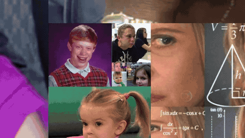

# Moot Spiral (Hult Animation)

Moot Spiral renders a collection of images into a hypnotic, infinite Fibonacci spiral animation. Originally created by **[5bitcube](https://github.com/5bitcube)** to showcase profile pictures of Twitter mutuals, this repository extends the project with a high-definition **Python MP4 video exporter**, background music synchronization, automatic square-cropping, and reverse zoom animations.

## Preview



---

## Features

- **Mathematical Fibonacci Geometry**: Perfectly preserves the logarithmic Fibonacci spiral with 4-direction orientation cycling and modulo texture shifting.
- **Direct MP4 Video Export**: Renders 60 FPS broadcast-grade H.264 video with AAC stereo audio—no screen capture tools required.
- **Audio Synchronization**: Automatically detects music tracks (`.m4a`, `.mp3`, `.wav`), trims to custom start offsets, and applies smooth ending fade-outs.
- **Stop & Reverse Motion Mode**: Dynamic easing that zooms in, decelerates to a standstill, and reverses outward.
- **Auto Center-Crop**: Handles arbitrary rectangular photos (including high-resolution camera shots) by automatically cropping them to 1:1 squares without distortion.
- **Interactive C Viewer**: Native C + Raylib desktop application for real-time interactive zooming.

---

## Quick Start (Python Video Exporter)

### 1. Installation
Ensure Python 3.8+ is installed, then install the dependencies:
```bash
pip install -r requirements.txt
```

### 2. Add Photos & Music
- **Photos**: Place your square or rectangular images (`.jpg`, `.png`, `.webp`) in the `moots/` directory (7 default sample avatars are provided out of the box).
- **Music (Optional)**: Place your audio file (`.m4a`, `.mp3`, `.wav`) in the project root directory.

### 3. Generate Video
Run the export script:

```bash
# Basic export (default 60s, continuous zoom)
python export_spiral_video.py

# Custom duration and audio start offset (e.g. 60s video starting at 32s in audio)
python export_spiral_video.py --start 32 --duration 60

# With stop-and-reverse animation
python export_spiral_video.py --start 32 --duration 60 --reverse

# 1080p Full HD render
python export_spiral_video.py --width 1920 --height 1080 --duration 30
```

### CLI Reference

| Option | Type | Default | Description |
| :--- | :--- | :--- | :--- |
| `--start` | `float` | `32.0` | Audio start offset in seconds |
| `--duration` | `float` | `60.0` | Video duration in seconds (defaults to remaining audio duration) |
| `--reverse` | `flag` | `False` | Enables stop-and-reverse animation sequence |
| `--width` | `int` | `1280` | Video resolution width |
| `--height` | `int` | `720` | Video resolution height |

---

## Interactive C Application (Raylib)

### Requirements
- C compiler (GCC / MinGW-w64)
- Raylib graphics library installed and in PATH

### Building & Running
- **Windows**: Run `build.bat`
- **Linux / macOS**: Run `./build.sh`

### Controls
- **ESC**: Exit application
- **Right Arrow**: Increase zoom speed
- **Left Arrow**: Reduce zoom speed (or reverse zoom)

---

## Credits & Acknowledgments

- **Original Creator & Concept**: Created by **[5bitcube](https://github.com/5bitcube)** ([5bitcube/moot-spiral](https://github.com/5bitcube/moot-spiral)).
- **Sample Avatars**: The default sample images in `moots/` are provided from the original upstream repository.
- **Python Video Exporter & Audio Engine**: Built by [Coden-inja](https://github.com/Coden-inja).

---

## License

This project is licensed under [The Unlicense](LICENSE) (Public Domain).
